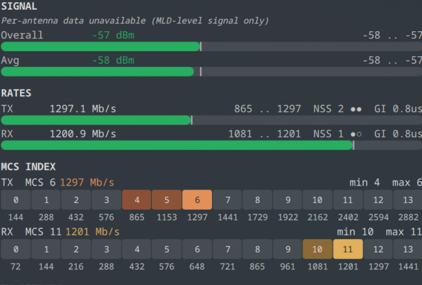

# wifimimo

Live Wi-Fi link telemetry for Linux — daemon, curses monitor, and KDE Plasma 6 panel widget.
Surfaces signal, MIMO/MLO topology, modulation/coding, spatial streams, guard interval, and
the full per-MCS rate ladder for **Wi-Fi 4 / 5 / 6 / 6E / 7** links.



Current version: `0.3.0` · See [CHANGELOG.md](CHANGELOG.md) · Use GitHub Issues for bugs and feature requests.

## What it shows

For every association, in real time:

- **Connection** — SSID, BSSID, frequency(s), channel(s), bandwidth, link uptime
- **Wi-Fi generation** — automatic *Wi-Fi 4 / 5 / 6 / 6E / 7* detection with the IEEE PHY name (HT / VHT / HE / EHT) appended
- **MLO** — Wi-Fi 7 multi-link operation: per-link freq / channel / width, gold panel icon when 2+ radio links are aggregated
- **Signal** — overall, average, per-antenna chain (when the driver exposes it), and the spread between chains; coloured by canonical thresholds (-65 / -75 dBm)
- **Rates** — TX / RX live throughput plus the historical min/max range, with NSS dots and guard-interval µs label
- **MCS** — current MCS index per direction with the full rate ladder underneath (12 cells for HE, **14 for EHT** including 4096-QAM MCS 12/13)
- **Retries** — 10-second sliding window of TX retries / failed packets

The panel icon's colour is the link-state TL;DR:

| Icon | State |
|---|---|
| Grey (dimmed) | No link / wifi off / stale data |
| **Red** | Connected, both directions collapsed to NSS 1 (real MIMO degradation) |
| **Gold** | Connected, 2x2, multi-link MLO actively aggregating |
| **Blue** | Connected, 2x2, single-link 6 GHz |
| White (default) | Connected, 2x2, anything else |

## Requirements

- Linux with an `nl80211`-based Wi-Fi driver
- Python 3 with `venv`
- `iw` userspace utility
- KDE Plasma 6 (optional, only for the panel widget)

## Install

```bash
git clone https://github.com/pizzimenti/wifimimo.git && cd wifimimo
./install.sh
```

The installer:

| Path | Role |
|------|------|
| `/usr/local/lib/wifimimo/` | Daemon + monitor + plasmoid source bridge + venv |
| `/usr/local/bin/wifimimo-daemon` | Background poller |
| `/usr/local/bin/wifimimo-mon` | Curses monitor launcher |
| `/usr/local/bin/wifimimo-plasmoid-source` | One-shot state-file dumper used by the plasmoid |
| `~/.config/systemd/user/wifimimo-daemon.service` | User systemd service (auto-enabled) |
| Plasmoid (via `kpackagetool6`) | Per-user `org.kde.plasma.wifimimo` widget |

The script also restarts `plasma-plasmashell.service` so the new widget code loads
without you having to log out and back in.

## Daemon

`wifimimo-daemon` polls nl80211 station data via `pyroute2` and writes a versioned
JSON state file to `/run/user/$UID/wifimimo-state` (`schema_version: 2`). It also
appends a daily CSV history to `~/.local/state/wifimimo/history/<date>.csv` so you
can plot link quality over time later.

Polling cadence is adaptive:

- **1 s** when the popup is expanded (the plasmoid touches a marker file each poll)
- **1 s** for 30 s after any state transition, or while the link is degraded
  (NSS < 2 in both directions, retry-rate > 30 %, or signal < -75 dBm)
- **5 s** otherwise — the steady-state battery-friendly cadence

EHT / MLO collection works correctly even when the kernel can't fill in standard
`NL80211_ATTR_WIPHY_FREQ` for an MLD parent (per-link `freq` / `width` are pulled
from `iw dev <iface> link` as a structured fallback).

## Curses monitor

```bash
wifimimo-mon
```

Same telemetry as the panel, in a terminal. Adds a per-link `LINKS` section when
multi-link MLO is active.

## Plasma widget

A KDE Plasma 6 panel widget that consumes the daemon's JSON state file. Compact
representation = a single coloured icon (see table above). Expanded popup = the
full telemetry pictured at the top of this README.

To re-add the widget after install: right-click the panel → Add Widgets → search
"wifimimo".

## State schema

The runtime state file is JSON v2. Stable contract:

```jsonc
{
  "schema_version": 2,
  "iface": "wlp1s0",
  "connected": true,
  "ssid": "...", "ssid_display": "...", "bssid": "...",
  "freq_mhz": 6295, "chan_num": 69, "bandwidth_mhz": 160,
  "signal_dbm": -57, "signal_avg_dbm": -58,
  "signal_antennas": [-58, -56],
  "tx_rate_mbps": 1297.1, "tx_mcs": 6, "tx_nss": 2, "tx_mode": "EHT", "tx_gi": 0,
  "rx_rate_mbps": 1200.9, "rx_mcs": 11, "rx_nss": 1, "rx_mode": "EHT", "rx_gi": 0,
  "tx_packets": 0, "tx_retries": 0, "tx_failed": 0, "rx_packets": 0,
  "connected_time_s": 0,
  "retry_10s_pct": 0.0, "retry_10s_packets": 0, "retry_10s_retries": 0, "retry_10s_failed": 0,
  "links": [
    { "link_id": 2, "bssid": "...", "freq_mhz": 6295, "chan_num": 69, "bandwidth_mhz": 160, ... }
  ],
  "display": {
    "band_label": "6 GHz", "wifi_label": "Wi-Fi 7 / EHT",
    "signal_tier": "good", "signal_fraction": 0.47, "antenna_fractions": [...],
    "tx_nss_dots": "●●", "rx_nss_dots": "●○",
    "tx_gi_label": "0.8us", "rx_gi_label": "0.8us",
    "tx_rates_mbps": [144, 288, ..., 2882],
    "rx_rates_mbps": [72, 144, ..., 1441],
    "mcs_grid_count": 14
  }
}
```

The `display` block is daemon-computed and is the canonical source for UI rendering;
the curses monitor and plasmoid both read from it directly so the visual logic
stays in one place.

## Known driver limitations

Some Wi-Fi chips and firmware don't expose every counter when MLO is in use.
On `mt7925e` (Mediatek Wi-Fi 7) MLD associations, the kernel returns:

- **No per-antenna chain signal** — `NL80211_STA_INFO_CHAIN_SIGNAL` empty
- **Always-zero TX retries** — every level (`iw` / `nl80211` / sysfs / debugfs phy / mt76 driver-private) reports 0

The plasmoid surfaces these as small italic hints in the relevant sections so a
suspicious 0 reads as "data unavailable" instead of "perfect link". Switching to
a non-MLO association (legacy SSID, no `MLD … stats` block) brings both counters
back to life on the same hardware.

## Tests + CI

```bash
pip install -r requirements.txt -r requirements-dev.txt
pytest -q
```

Suite covers PHY-mode round-tripping (HT/VHT/HE/EHT), iw output fixtures
(single-link / MLO / disconnected / VHT), state file (write, read, v1 migration,
forward-compat), derived display, history-CSV schema rotation, and a QML parity
check that fails CI if PHY-mode literals leak back into the QML.

GitHub Actions CI runs on `ubuntu-24.04` with Python `3.12.7`.

## License

MIT
