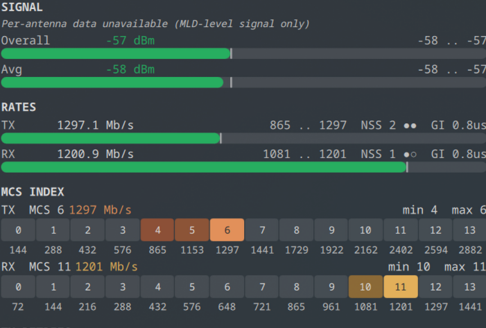

# wifimimo

Live Wi-Fi link telemetry for Linux — daemon, curses monitor, and KDE Plasma 6 panel widget.
Surfaces signal, MIMO/MLO topology, modulation/coding, spatial streams, guard interval, and
the full per-MCS rate ladder for **Wi-Fi 4 / 5 / 6 / 6E / 7** links.



Current version: `0.4.0` · See [CHANGELOG.md](CHANGELOG.md) · Use GitHub Issues for bugs and feature requests.

## What it shows

For every association, in real time:

- **Connection** — SSID, BSSID, frequency(s), channel(s), bandwidth, link uptime
- **Wi-Fi generation** — automatic *Wi-Fi 4 / 5 / 6 / 6E / 7* detection with the IEEE PHY name (HT / VHT / HE / EHT) appended
- **MLO** — Wi-Fi 7 multi-link operation: per-link freq / channel / width, gold panel icon when 2+ radio links are aggregated
- **Signal** — overall, average, per-antenna chain (when the driver exposes it), and the spread between chains; coloured by canonical thresholds (-65 / -75 dBm)
- **Rates** — TX / RX live throughput plus the historical min/max range, with NSS dots and guard-interval µs label
- **MCS** — current MCS index per direction with the full rate ladder underneath (12 cells for HE, **14 for EHT** including 4096-QAM MCS 12/13)
- **Retries** — 10-second sliding window of TX retries / failed packets

The panel icon's colour is the link-state TL;DR:

| Icon | State |
|---|---|
| Grey (dimmed) | No link / wifi off / stale data |
| **Red** | Connected, both directions collapsed to NSS 1 (real MIMO degradation) |
| **Gold** | Connected, 2x2, multi-link MLO actively aggregating |
| **Blue** | Connected, 2x2, single-link 6 GHz |
| White (default) | Connected, 2x2, anything else |

## Requirements

- Linux with an `nl80211`-based Wi-Fi driver
- Python 3 with `venv`
- `iw` userspace utility
- KDE Plasma 6 (optional, only for the panel widget)

## Install

```bash
git clone https://github.com/pizzimenti/wifimimo.git && cd wifimimo
./install.sh
```

The installer:

| Path | Role |
|------|------|
| `/usr/local/lib/wifimimo/` | Daemon + monitor + modules + venv |
| `/usr/local/lib/wifimimo/wifimimo-helper` | Root helper (multipath, internal card), root-owned |
| `/usr/local/bin/wifimimo-daemon` | Background poller |
| `/usr/local/bin/wifimimo-mon` | Curses monitor launcher |
| `/usr/local/bin/wifimimo-nm-tidy` | Collapses per-card copies of NetworkManager profiles |
| `/usr/local/bin/wifimimo-plasmoid-source` | One-shot state-file dumper |
| `/usr/share/polkit-1/actions/io.github.pizzimenti.wifimimo.policy` | polkit action for the helper |
| `/etc/NetworkManager/dispatcher.d/90-wifimimo` | Re-applies multipath on network changes |
| `/etc/iproute2/rt_protos.d/wifimimo.conf` | Names route protocol 211 `wifimimo` |
| `/etc/wifimimo/` | Multipath / internal-card state (root-owned) |
| `~/.config/systemd/user/wifimimo-daemon.service` | User systemd service (auto-enabled) |
| Plasmoid (via `kpackagetool6`) | Per-user `org.kde.plasma.wifimimo` widget |

The script also restarts `plasma-plasmashell.service` so the new widget code loads
without you having to log out and back in.

Options:

```bash
./install.sh --manage-internal 14c3:7925     # let the widget toggle an internal PCI card
./install.sh --manage-internal auto          # ...every bound PCI wifi card present now
./install.sh --manage-internal 14c3:7925=mt7925e   # card not present: name the driver
./install.sh --migrate-legacy-rules          # move hand-made "remove this card" udev rules aside
./install.sh --uninstall                     # remove everything (restores the internal card)
```

## Daemon

`wifimimo-daemon` auto-discovers every wifi netdev under `/sys/class/net`
(re-scanned each poll, so a hotplugged USB card appears without a restart),
polls nl80211 station data for each via `pyroute2`, and writes a versioned
JSON state file to `/run/user/$UID/wifimimo-state` (`schema_version: 4`). It also
appends a daily CSV history row per card to
`~/.local/state/wifimimo/history/<date>.csv` so you can plot link quality over
time later. Set `WIFI_IFACE=<name>` in the service environment to pin the
daemon to one card instead — the state document (including `ifaces` and
`interfaces`) then carries only that card.

Polling cadence is adaptive:

- **1 s** when the popup is expanded (the plasmoid touches a marker file each poll)
- **1 s** for 30 s after any state transition, or while the link is degraded
  (NSS < 2 in both directions, retry-rate > 30 %, or signal < -75 dBm)
- **5 s** otherwise — the steady-state battery-friendly cadence

EHT / MLO collection works correctly even when the kernel can't fill in standard
`NL80211_ATTR_WIPHY_FREQ` for an MLD parent (per-link `freq` / `width` are pulled
from `iw dev <iface> link` as a structured fallback).

## Curses monitor

```bash
wifimimo-mon            # primary card (the connected one)
wifimimo-mon wlp3s0f3u2 # a specific card
```

Same telemetry as the panel, in a terminal. Adds a per-link `LINKS` section when
multi-link MLO is active.

## Plasma widget

A KDE Plasma 6 panel widget that consumes the daemon's JSON state file. Compact
representation = a single coloured icon (see table above). The expanded popup is
sized to its content with no scrolling; every card renders the same skeleton, so
nothing shifts when a card goes down or you switch cards. From the top:

- **Controls** — *Multipath* and *Internal Wi-Fi* switches on one line (see
  below); hover a label for its status.
- **Signal, last 60 s** — signal (dBm) for every radio on a fixed −90…−30 dBm
  axis with good / warn / bad bands, so link quality reads at a glance. The axis
  never rescales. Points are placed by time, and gaps (radio down) break the line.
- **Card selector** — one button per card (the first is selected by default); each card shows a
  filled dot when up, a hollow one when down, and `!` when flagged. A switched-off
  internal card keeps a ghost button.
- **Card panel** — the card's name (e.g. `A9000`, `A8000`, `Built-in`), SSID or
  the reason it's down, device line (bus, USB speed, driver, MAC, address),
  health-flag chips, then SIGNAL / RATES / MCS / TX RETRIES. A down card keeps
  the same layout with dashes and empty meters instead of collapsing.

To re-add the widget after install: right-click the panel → Add Widgets → search
"wifimimo".

## Multipath

On networks that cap bandwidth *per client* (libraries, cafés, hotels), several
radios get several allowances. Turning on **Multipath** balances new connections
across every connected radio at layer 4 (the kernel hashes each TCP/UDP flow's
5-tuple onto one radio), measured at roughly 2× with two radios and up to ~3×
upload with three. A single download still uses one radio; it can't be split.

How it works: the root helper keeps its routes **outside** the main table
(NetworkManager prunes unknown routes there):

| Priority | Rule | Purpose |
|---|---|---|
| 32000 | `lookup main suppress_prefixlength 0` | NM's specific routes (LAN, VPNs) still win |
| 32001+ | `from <radio address> lookup 101+` | replies leave the radio they came in on |
| 32090 | `lookup 100` | table 100 holds the one multipath default route |

It also sets `fib_multipath_hash_policy=1`, `ignore_routes_with_linkdown=1`,
`rp_filter=2` and `arp_ignore=1` / `arp_announce=2` on member radios (originals
restored on disable). A radio only joins when NetworkManager reports full
connectivity (so a captive portal can't swallow a share of your connections) and
its gateway answers. The dispatcher hook rebuilds the layout on every connect,
disconnect or DHCP change. The setting survives reboots.

Radios on the same access point or channel share airtime, so they gain nothing
from each other; wifimimo flags that. IPv4 only.

Recovery, if anything ever goes wrong: `pkexec /usr/local/lib/wifimimo/wifimimo-helper multipath disable`,
or just `sudo ip rule del pref 32090`.

### Following your network choice (NetworkManager)

While multipath is on, the daemon makes one click in the Plasma network applet
drive every radio: the network you pick becomes the leader and every other radio
that can see it joins the same profile, preferring an access point on a different
channel. Pick another network and they all follow; disconnect and they all drop.
No per-card profile copies are needed, and NetworkManager's saved profiles are
never modified (only an in-memory `multi-connect` change, reverted when multipath
is turned off). It runs as you, so passwords come from your own keyring.

It won't follow a profile that's tied to one card (`mac-address` /
`interface-name` set) or that clones one MAC for every radio (`stable` /
`stable-ssid` without `${DEVICE}` in `connection.stable-id`); those get a flag.
`wifimimo-nm-tidy` (dry run by default, `--apply` to act) removes the card-bound
copies people made by hand for multi-radio use, keeping the original profile.

## Internal card toggle

With `install.sh --manage-internal <vendor:device>`, the widget gets an
*Internal Wi-Fi* switch for a built-in PCI card: useful when a USB stick is
impractical (flights, walking around) but you normally keep the internal radio
off. Off removes the card from the PCI bus (like unplugging it); on rescans the
bus and loads its driver. The choice survives reboots via a generated udev rule
(`/etc/udev/rules.d/70-wifimimo-internal.rules`, from `/etc/wifimimo/internal.conf`).
The driver module is never unloaded, since it can be shared with USB sticks of
the same chip family.

## Health flags

Each card carries flags the widget shows as chips and the monitor lists:

| Flag | Meaning |
|---|---|
| Running at USB 2 | A USB 3 stick negotiated 480 Mb/s on a USB 3 port: reseat it firmly |
| USB 2 port | A USB 3 stick on a USB 2-only port |
| Shares an access point / a channel | Two radios split one airtime budget |
| ARP flux risk | Several radios in one subnet without `arp_ignore` / `arp_announce` |
| Weak signal / antenna, antenna imbalance, MIMO offline / degraded, high interference | Link-level checks |
| Profile tied to one card, shared cloned MAC | NetworkManager follow can't use this profile |

## Card names

Cards get short names: known models by USB id (`A9000`, `A8000`), `Built-in` for
PCI cards, otherwise vendor + chip (e.g. `NetGear MT7921U`). Override any of them
in `~/.config/wifimimo/names.json`, keyed by permanent MAC:

```json
{ "28:94:01:bb:f8:96": "Travel stick" }
```

## Security model

Everything privileged goes through one root helper with a fixed command set
(`multipath enable|disable|apply|status`, `internal enable|disable|status|sync-rules`).
It accepts no interface names, paths or numbers from the caller, runs under
`python3 -I`, and only touches routes, rules and tables it owns. The polkit
action lets processes in the **active local session** run it without a password
(that's what makes the switches usable on a plane); inactive and remote sessions
need admin authentication. Anything running as you in your desktop session can
therefore toggle multipath or the internal card.

## State schema

The runtime state file is JSON v4. The top level mirrors the *primary*
interface's full state (schema-v2 shape, so older consumers keep working);
`ifaces` lists every discovered card and `interfaces` maps each card name to
its own full state of the same shape. v4 adds per-card `card_name`, `perm_mac`,
`bus`, `driver`, `dev_id`, `usb_speed_mbps`, `ipv4` / `subnet` / `gateway`,
`rx_mbps` / `tx_mbps`, `signal_history` (`[[unix_ts, dBm], ...]`, last 60 s),
`flags` (`{code, severity, title, detail}`) and `color_index`, plus
document-level `multipath`, `internal_card`, `nm`, `helper_available` and
`sampled_at` (never repeated inside `interfaces`). Stable contract:

```jsonc
{
  "schema_version": 4,
  "iface": "wlp3s0f3u2",
  "ifaces": ["wlp1s0", "wlp3s0f3u2"],
  "interfaces": { "wlp1s0": { /* full per-card state */ }, "wlp3s0f3u2": { /* … */ } },
  "connected": true,
  "ssid": "...", "ssid_display": "...", "bssid": "...",
  "freq_mhz": 6295, "chan_num": 69, "bandwidth_mhz": 160,
  "signal_dbm": -57, "signal_avg_dbm": -58,
  "signal_antennas": [-58, -56],
  "tx_rate_mbps": 1297.1, "tx_mcs": 6, "tx_nss": 2, "tx_mode": "EHT", "tx_gi": 0,
  "rx_rate_mbps": 1200.9, "rx_mcs": 11, "rx_nss": 1, "rx_mode": "EHT", "rx_gi": 0,
  "tx_packets": 0, "tx_retries": 0, "tx_failed": 0, "rx_packets": 0,
  "connected_time_s": 0,
  "retry_10s_pct": 0.0, "retry_10s_packets": 0, "retry_10s_retries": 0, "retry_10s_failed": 0,
  "links": [
    { "link_id": 2, "bssid": "...", "freq_mhz": 6295, "chan_num": 69, "bandwidth_mhz": 160, ... }
  ],
  "display": {
    "band_label": "6 GHz", "wifi_label": "Wi-Fi 7 / EHT",
    "signal_tier": "good", "signal_fraction": 0.47, "antenna_fractions": [...],
    "tx_nss_dots": "●●", "rx_nss_dots": "●○",
    "tx_gi_label": "0.8us", "rx_gi_label": "0.8us",
    "tx_rates_mbps": [144, 288, ..., 2882],
    "rx_rates_mbps": [72, 144, ..., 1441],
    "mcs_grid_count": 14
  }
}
```

The `display` block is daemon-computed and is the canonical source for UI rendering;
the curses monitor and plasmoid both read from it directly so the visual logic
stays in one place.

## Known driver limitations

Some Wi-Fi chips and firmware don't expose every counter when MLO is in use.
On `mt7925e` (Mediatek Wi-Fi 7) MLD associations, the kernel returns:

- **No per-antenna chain signal** — `NL80211_STA_INFO_CHAIN_SIGNAL` empty
- **Always-zero TX retries** — every level (`iw` / `nl80211` / sysfs / debugfs phy / mt76 driver-private) reports 0

The plasmoid surfaces these as small italic hints in the relevant sections so a
suspicious 0 reads as "data unavailable" instead of "perfect link". Switching to
a non-MLO association (legacy SSID, no `MLD … stats` block) brings both counters
back to life on the same hardware.

## Tests + CI

```bash
pip install -r requirements.txt -r requirements-dev.txt
pytest -q
```

Suite covers PHY-mode round-tripping (HT/VHT/HE/EHT), iw output fixtures
(single-link / MLO / disconnected / VHT), state file (write, read, v1 migration,
forward-compat), derived display, history-CSV schema rotation, sysfs bus / USB
port detection on fake trees, health flags, card names, the helper's argument
validation and routing plans (ordering, idempotency, teardown, refusal of
foreign state), the internal-card udev rule, NetworkManager follow and tidy
planning, cross-file packaging facts (polkit path, dispatcher, versions), and a
QML parity check that fails CI if PHY-mode literals leak back into the QML.

GitHub Actions CI runs on `ubuntu-24.04` with Python `3.12.7`.

Widget development: `tools/pv -t 10` runs the plasmoid in `plasmoidviewer` with
every QML message on stdout. Qt 6 sends logging to the systemd journal whenever
the process has no controlling terminal (IDE and agent shells), so without the
script the messages are only in `journalctl --user _COMM=plasmoidviewer`. The
installed widget always logs to the journal:
`journalctl --user -u plasma-plasmashell.service -f --grep wifimimo`.

## License

MIT
